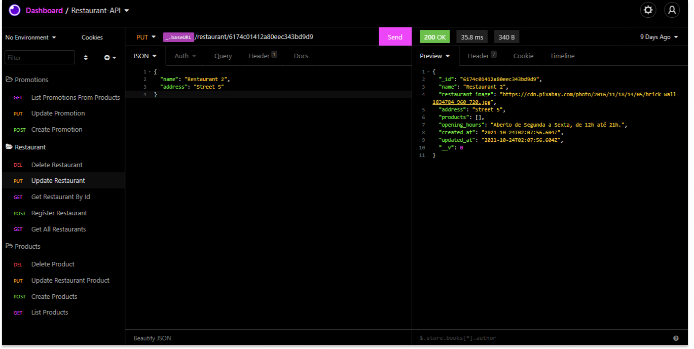

# Restaurant-API - Backend

- **Objetivo do Projeto:** Criar uma API RESTful capaz de gerenciar os restaurantes e os produtos do seu cardápio.

### Desafio

- A sua API deverá ser capaz de:
    - [x] Listar todos os restaurantes
    - [x] Cadastrar novos restaurantes
    - [x] Listar os dados de um restaurante
    - [x] Alterar os dados um restaurante
    - [x] Excluir um restaurante
    - [x] Listar todos os produtos de um restautante
    - [x] Criar um produto de um restaurante
    - [x] Alterar um produto de um restaurante
    - [x] Excluir um produto de um restaurante

- O cadastro do restaurante precisa ter os seguintes campos:
    - Foto do restaurante
    - Nome do restaurante
    - Endereço do restaurante
    - Horários de funcionamento do restaurante (ex.: De Segunda à Sexta das 09h as 18h e de Sabado à Domingo das 11h as 20h).

- O cadastro de produtos do restaurante precisa ter os seguintes campos:
    - Foto do produto
    - Nome do produto
    - Preço do produto
    - Categoria do produto (ex.: Doce, Salgados, Sucos...)
    - Quando o Produto for colocado em promoção, precisa ter os seguintes campos:
        - Descrição para a promoção do produto (ex.: Chopp pela metade do preço)
        - Preço promocional
        - Dias da semana e o horário em que o produto deve estar em promoção

### Happy coding 